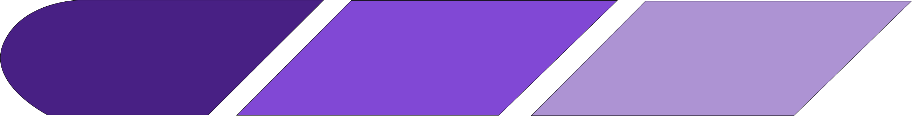

<!-- PROJECT SHIELDS -->
[![contributors][contributors-shield]][contributors-url]
[![commits][commits-shield]][commits-url]

<!-- PROJECT LOGO --> 
<br />
<div align="center">
  <a href=“katieshi413.github.io/open-devsecops.github.io/”> 
    
  </a>
  <h1 align="center">Open DevSecOps v2</h1>
</div>

<!-- TABLE OF CONTENTS -->
<details>
  <summary>Table of Contents</summary>
  <ol>
    <li>
      <a href="#about-the-project">About The Project</a>
      <ul>
        <li><a href="#built-with">Built With</a></li>
      </ul>
    </li>
    <li>
      <a href="#getting-started">Getting Started</a>
      <ul>
        <li><a href="#prerequisites">Prerequisites</a></li>
        <li><a href="#installation">Installation</a></li>
      </ul>
    </li>
    <li><a href="#contact">Contact</a></li>
  </ol>
</details>

<!-- ABOUT THE PROJECT -->

## About The Project

Many students entering the software industry are unprepared for the newest expectations of entry-level roles, where understanding security and efficient operations are the bare-minimum at every phase of the software development lifecycle. The "Open-DevSecOps" project addresses this significant gap in education concerning DevSecOps and CI/CD principles. Our extensively researched online modules aim to offer a free educational service to enhance the understanding and application of these crucial skills. This project strives to provide essential up-to-date training, and shape the security industry's future for the better starting with every new-grad employee. 

### Final Website

www.katieshi413.github.io/open-devsecops.github.io/

### Final Presentation

https://docs.google.com/presentation/d/1ESrzQka0eZ1L1KLqiXgI0yj2_FuhhFSfokiGwJE8K3o/edit?usp=sharing

### Built With

* [![Jekyll][Jekyll]][Jekyll-url]
* [![Ruby][Ruby]][Ruby-url]
* [![Markdown][Markdown]][Markdown-url]


<p align=“right”>(<a href=“#readme-top”>back to top</a>)</p>

<!-- GETTING STARTED -->

## Getting Started

 To get a local copy up and running follow these steps.

### Prerequisites
-   Ruby 3.4.1
-   [Bundler](https://bundler.io/)
-   [Jekyll](https://jekyllrb.com/) 

### Installation

1.  Install Ruby and Bundler
    
    ```sh
    # If you haven’t already, install Ruby (version 3.4.1), then install Bundler:
    gem install bundler
    ```
    
2.  Navigate to the project directory
    
    ```sh
    cd your-project-directory
    ```

3.  Install project dependencies
    
    ```sh
    bundle install
    ```

4.  Serve the site locally
    
    ```sh
    bundle exec jekyll serve
    ```
5.  Open your browser and visit:
    
    ```sh
    http://localhost:4000
    ```

<p align=“right”>(<a href=“#readme-top”>back to top</a>)</p>

<!-- CONTACT -->
## Contact

<p>Katie Shi - <a href="https://www.linkedin.com/in/katie-shi-ab4973185/">LinkedIn</a> - <a href= "mailto: katieshi413@gmail.com"> katieshi413@gmail.com </a></p>
<p>Emily Choi - <a href="https://www.linkedin.com/in/emily-choii/">LinkedIn</a> - <a href= "mailto: eemilychoi@gmail.com"> eemilychoi@gmail.com </a></p>
<p>Jocelyn Margarones - <a href="https://www.linkedin.com/in/jocelyn-margarones-666770236/">LinkedIn</a> - <a href= "mailto: jsmargarones@gmail.com"> jsmargarones@gmail.com </a></p>
<p>Mor Vered - <a href="https://www.linkedin.com/in/mor-vered-470a36257/">LinkedIn</a> - <a href= "mailto: mvered9@gmail.com"> mvered9@gmail.com </a></p>
<p>Mira Nair - <a href="https://www.linkedin.com/in/miranair/">LinkedIn</a> - <a href= "mailto: miranair004@gmail.com"> miranair004@gmail.com </a></p>

<p align="right">(<a href="#readme-top">back to top</a>)</p>

<!-- MARKDOWN LINKS & IMAGES -->
[contributors-shield]: https://img.shields.io/github/contributors/katieshi413/open-devsecops.github.io?style=for-the-badge&color=rgb(68%2C%20204%2C%2017)
[contributors-url]: https://github.com/katieshi413/open-devsecops.github.io/graphs/contributors
[commits-shield]: https://img.shields.io/github/commit-activity/t/katieshi413/open-devsecops.github.io?style=for-the-badge
[commits-url]: https://github.com/katieshi413/open-devsecops.github.io/commits/main/
[Jekyll]: https://img.shields.io/static/v1?style=for-the-badge&message=Jekyll&color=CC0000&logo=Jekyll&logoColor=FFFFFF&label=
[Jekyll-url]: https://jekyllrb.com/
[Ruby]: https://img.shields.io/badge/Ruby-CC342D?logo=Ruby&logoColor=white
[Ruby-url]: https://www.ruby-lang.org/en/
[Markdown]: https://img.shields.io/badge/markdown-%23000000.svg?style=for-the-badge&logo=markdown&logoColor=white
[Markdown-url]: https://www.markdownguide.org/
