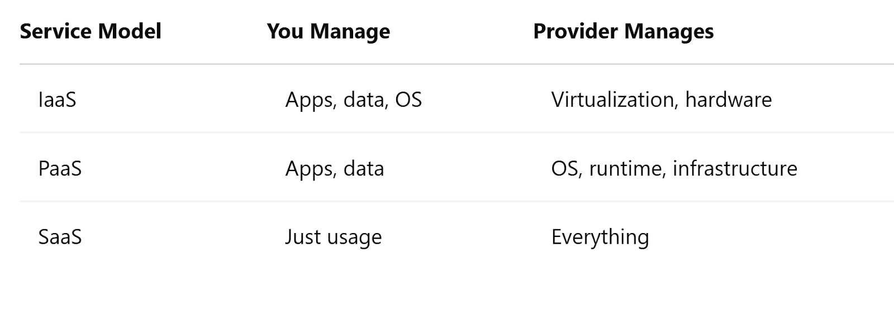

# Introduction to Cloud

The cloud has become the foundation upon which DevSecOps practices are built. From scalable infrastructure to rapid deployment capabilities, understanding the cloud is key to implementing secure, efficient pipelines.

---

## What is Cloud Computing?

Imagine needing a powerful computer to test your code, store large amounts of data, or run an app for millions of users. Instead of buying expensive hardware, you rent what you need—on demand, from someone else’s infrastructure. That, in essence, is cloud computing.

Cloud computing provides on-demand access to computing resources—like servers, storage, and networking—delivered over the internet. Instead of managing physical hardware, teams can scale up or down their computing needs quickly and cost-effectively.

> **NIST Definition**: "Cloud computing is a model for enabling ubiquitous, convenient, on-demand network access to a shared pool of configurable computing resources."

---

## Key Benefits

- **Scalability**: Adjust resources based on demand  
- **Cost efficiency**: Pay only for what you use  
- **Speed**: Rapid provisioning of infrastructure  
- **Accessibility**: Work from anywhere  

---

## Example Scenario

Ani is building a web app that lets users upload and edit videos. She needs a way to store large video files, process them quickly, and make the app available globally. Instead of setting up servers herself, Ani uses Amazon Web Services (AWS) to host her application, run processing jobs, and store videos in the cloud. The cloud lets her focus on building features—not managing hardware.

---

## Cloud Service Models

Cloud services fall into three main categories. Think of them as layers of abstraction that handle more and more of the infrastructure for you:

### 1. IaaS – Infrastructure as a Service
You rent virtual machines, storage, and networking. You manage the OS and software.  
**Examples**: AWS EC2, Microsoft Azure Virtual Machines

### 2. PaaS – Platform as a Service
You build apps on top of a managed platform. The provider handles the OS, runtime, and infrastructure.  
**Examples**: Heroku, Google App Engine

### 3. SaaS – Software as a Service
You use the software over the internet without worrying about how it runs.  
**Examples**: Google Workspace, GitHub

---

## Cloud Deployment Models

Different organizations use the cloud in different ways depending on their needs, size, and security posture.

- **Public Cloud**  
  Services offered over the internet and shared across organizations.  
  *Examples*: AWS, Azure, GCP  
  *Use Case*: Startups, scalable applications  

- **Private Cloud**  
  Cloud environment dedicated to a single organization.  
  *Use Case*: Healthcare, financial institutions  

- **Hybrid Cloud**  
  Mix of public and private clouds.  
  *Use Case*: Enterprises with legacy systems  

- **Multi-Cloud**  
  Using services from multiple cloud providers.  
  *Use Case*: Large enterprises avoiding vendor lock-in  

---

## Cloud Security Fundamentals

Security in the cloud is a shared responsibility between the cloud provider and the customer.

### Shared Responsibility Model

- **Provider**: Security *of* the cloud (hardware, infrastructure, etc.)
- **Customer**: Security *in* the cloud (data, apps, IAM)

### Key Concepts

- **IAM (Identity & Access Management)**: Control who can access what, and what actions they can take  
- **Encryption**: Protect data in transit and at rest  
- **Logging & Monitoring**: Track system activity for threats and auditing  

---

## Summary

Cloud computing is the backbone of modern DevSecOps. It allows teams to innovate quickly, deploy securely, and scale easily. From choosing the right service model to understanding your security responsibilities, cloud knowledge is essential for any DevSecOps practitioner.

---



---

## Resources

- [Google Cloud Security Overview](https://cloud.google.com/blog/topics/developers-practitioners/google-cloud-security-overview)  
- [AWS Shared Responsibility Model](https://aws.amazon.com/compliance/shared-responsibility-model/)  
- [Azure Cloud Adoption Framework](https://learn.microsoft.com/en-us/azure/cloud-adoption-framework/)  
- [NIST SP 800-145](https://nvlpubs.nist.gov/nistpubs/Legacy/SP/nistspecialpublication800-145.pdf)  
- [IBM – What is Cloud Computing](https://www.ibm.com/think/topics/cloud-computing)
